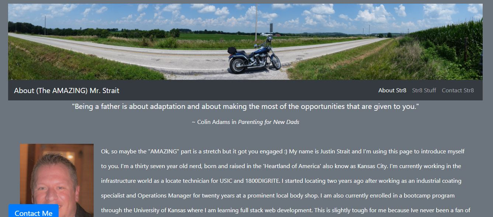
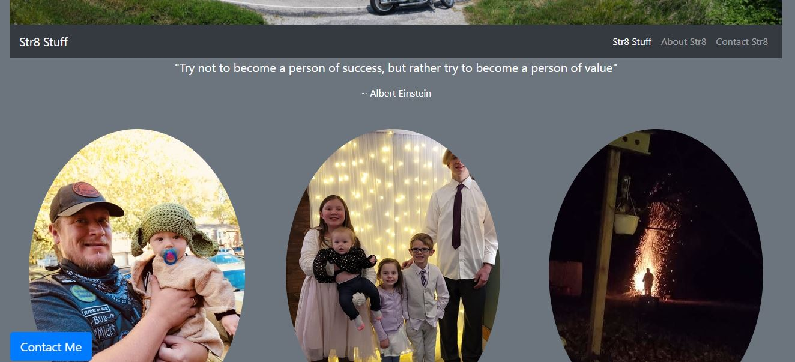
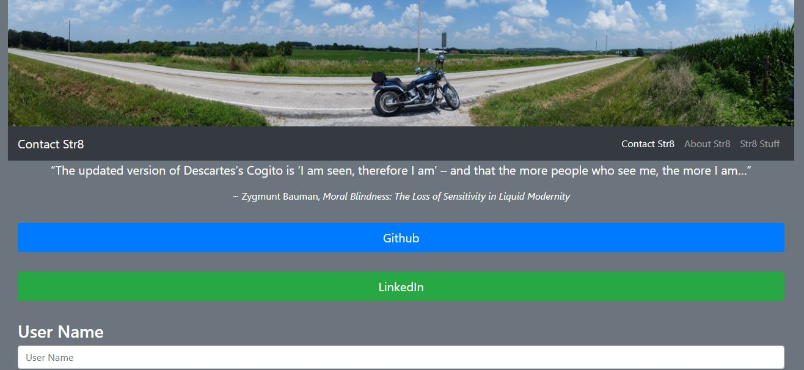

# AboutMeBootstrap

## This assignment was to make a series of bio pages using Bootstrap for elements and styling.

### I am using Bootstrap v4.5 for this assignment. 

Here is specific criteria:

    :integrate a navbar
    :responsive layout
    :responsive images
    :use Bootstrap grid system
    :functional and deployed application
    :GitHub repo and readme
    :navbar must be consistent on each page
    :navbar must contain links to other pages
    :use semantic html
    :must contain personal info
    :properly utilize Bootstrap components
    :incorporate a sticky footer

Here is the link to the deployed page: https://justrait.github.io/AboutMeBootstrap/

Here is the link to the repo: https://github.com/JuStrait/AboutMeBootstrap

